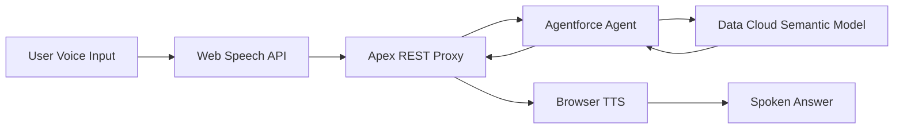

# VizVoice: Voice-First Accessibility for Tableau Dashboards

<!-- output: demo-out/vizvoice-demo.mp4 -->
<!-- engine: llmg -->
<!-- voice: Kore -->
<!-- theme: salesforce -->
<!-- viewport: 1920x1080 -->
<!-- target-duration: 300 -->
<!-- start-url: https://orgfarm-aac260ab62-dev-ed.develop.my.salesforce.com/apex/ui_bundle__vizvoice -->

## The Accessibility Problem

<!-- scene: slide -->
<!-- layout: value-overview -->

> Charts render as unlabeled graphics — invisible to screen readers. 253 million people locked out of dashboard insights.

- **The Gap:** Unlabeled SVG graphics
- **The Impact:** 253M people with zero access
- **The Solution:** Voice-first analytics

## Introducing VizVoice

<!-- scene: slide -->
<!-- layout: value-overview -->

> Voice-first Agentforce agent making dashboards accessible through natural conversation.

- **Ask Naturally:** Voice questions about your data
- **Hear Answers:** Data Cloud powers spoken responses
- **No Charts Needed:** Full analytics access without vision

## Live Demo: Voice Assistant

<!-- scene: browser -->
<!-- surface: einstein-studio -->

> Let's see VizVoice in action. {{1}} I'll navigate to the UI Bundle and activate the voice assistant with Alt-V. {{2}}

- navigate: https://orgfarm-aac260ab62-dev-ed.develop.my.salesforce.com/apex/ui_bundle__vizvoice
- wait: 5
- screenshot: screenshots/vizvoice-home.png
- press: Alt+v
- wait: 2

## Asking Questions by Voice

<!-- scene: browser -->

> Now I'll ask: "What line had the most cancellations?" {{1}} The agent analyzes the Data Cloud semantic model and responds with exact numbers — no visual metaphors. {{2}}

- wait: 3
- screenshot: screenshots/question-1.png
- wait: 5

## Accessibility-First Language Design

<!-- scene: slide -->
<!-- layout: value-overview -->

> Every response follows strict accessibility rules. No "as you can see." No chart references. Just the number first, with ordinal language like "the largest segment" instead of visual cues.

- **Zero Visual Metaphors:** No "as you can see" or "the chart shows"
- **Lead with Numbers:** "37 cancellations" not "looking at the data..."
- **Ordinal Language:** "The largest segment" not "the red bar"

## Three Layers of Accessibility

<!-- scene: slide -->
<!-- layout: value-overview -->

> Redesigned for accessibility. Three engineering layers.

1. **Agent Language:** Eliminates visual metaphors at the prompt level
2. **WCAG Compliance:** Color contrast, keyboard nav, ARIA
3. **Dual Output:** Voice plus screen reader coordination

## Agent Language Engineering

<!-- scene: slide -->
<!-- layout: value-overview -->

> We updated the Analytics Agent's system prompt with strict accessibility rules enforced at every API call through our Apex proxy.

- **Forbidden Phrases:** Blocked "as you can see", "the chart shows", visual references
- **Required Patterns:** Ordinal language, lead-with-number, exact comparisons
- **Testing:** 11 sample questions — zero visual metaphors in responses

## WCAG 2.1 AA Compliance

<!-- scene: slide -->
<!-- layout: value-overview -->

> Full accessibility audit with measurable compliance across color contrast, keyboard navigation, and screen reader support.

- **Color Contrast:** VizVoice blue 5.8:1 ratio (exceeds 4.5:1 minimum)
- **Keyboard-Only:** Alt-V shortcut, Tab navigation, visible focus indicators
- **ARIA Implementation:** Live regions pre-rendered for reliable announcements

## Voice + Screen Reader Dual Output

<!-- scene: slide -->
<!-- layout: value-overview -->

> Responses delivered both as spoken audio and screen reader announcements — voice can be missed, and Braille users need text.

- **Dual Output:** TTS audio plus ARIA live regions
- **Text Fallback:** Conversation history for review
- **Universal Access:** Works for all assistive technologies

## Technical Architecture

<!-- scene: diagram -->

> Under the hood: Agentforce Analytics Agent queries Data Cloud semantic models through our Apex REST proxy with OAuth authentication.

## Demo: Keyboard-Only Navigation

<!-- scene: browser -->

> The entire UI works with keyboard only. {{1}} Watch as I activate the assistant using just Alt-V — no mouse required. {{2}}

- screenshot: screenshots/keyboard-nav.png
- wait: 3

## Colorblind-Safe Design

<!-- scene: slide -->
<!-- layout: value-overview -->

> Every color was chosen from the Tableau 10 colorblind-safe palette and tested with deuteranopia simulation.

- **Blue Primary:** #4E79A7 — main brand color
- **Teal Accent:** #76B7B2 — interactive elements  
- **Orange Highlight:** #F28E2B — error states (not red)

## Impact and Results

<!-- scene: slide -->
<!-- layout: stat-tiles -->

> What we achieved in three weeks of focused accessibility engineering.

- 253M | people with vision impairment can now access analytics
- 11 | test questions — zero visual metaphors in responses
- 5.8:1 | color contrast ratio — exceeds WCAG AA standards
- 3 | layers of accessibility work — agent, UI, coordination

## Built Entirely on Salesforce

<!-- scene: slide -->
<!-- layout: value-overview -->

> No external AI services. No third-party APIs. Pure Salesforce platform — Agentforce, Data Cloud, UI Bundles, and Web Speech API.

- **Agentforce:** Analytics Agent with semantic data analysis
- **Data Cloud:** C360 semantic model for grounded answers
- **UI Bundle:** React frontend deployed as Salesforce metadata
- **Native Auth:** Apex REST with Named Credential OAuth

## The Future of Inclusive Analytics

<!-- scene: slide -->
<!-- layout: wrap -->

> VizVoice proves voice-first design can make analytics universally accessible. This is the future of inclusive data exploration.

- **Production-Ready:** Deployed UI Bundle in org
- **Fully Documented:** Comprehensive accessibility guides
- **Open Source:** GitHub repo with all code and docs
- **Built for Good:** Agentforce for Good Hackathon 2026

[GitHub: github.com/RussEvans222/VizVoice](https://github.com/RussEvans222/VizVoice)
