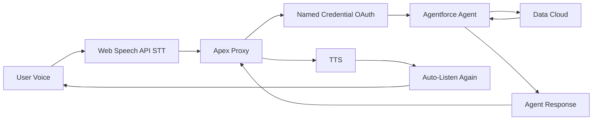

# VizVoice: Making Dashboards Accessible Through Voice

<!-- output: demo-out/vizvoice-v2.mp4 -->
<!-- engine: llmg -->
<!-- voice: Aoede -->
<!-- theme: salesforce -->
<!-- viewport: 1920x1080 -->
<!-- target-duration: 300 -->
<!-- start-url: https://orgfarm-aac260ab62-dev-ed--c.develop.my.salesforce.app/app/c__vizvoice -->

## Meet Sarah: A Data Analyst Who Can't See Charts

<!-- scene: slide -->
<!-- layout: value-overview -->

> Sarah is a senior data analyst at a transit agency. She's blind and uses JAWS screen reader every day. Her manager just sent her a Tableau dashboard to analyze December performance. Here's what happens when she opens it.

- **JAWS announces** — "Chart, unlabeled graphic"
- **Sarah tries to explore** — Nothing. No data. No text.
- **The dashboard is invisible** — All insights locked in visual-only SVG
- **She has to ask a colleague** — "Can you tell me what this shows?"

## What a Screen Reader Actually Hears

<!-- scene: slide -->
<!-- layout: value-overview -->

> Let me show you what JAWS announces when Sarah opens a typical Tableau dashboard. This is the actual output — nothing made up.

- **"Heading level 1: Dashboard"** — Okay, title works
- **"Graphic"** — That's the bar chart. No data.
- **"Graphic"** — That's the line chart. No values.
- **"Graphic"** — That's the legend. No labels.
- **End of content** — Sarah learned nothing about the data

## 253 Million People Are Locked Out

<!-- scene: slide -->
<!-- layout: value-overview -->

> This isn't a Sarah problem. It's a design problem. Data visualizations are built for eyes only — charts render as unlabeled SVG with zero semantic meaning.

- **Alt text doesn't scale** — Can't describe multi-series, interactive charts
- **Image descriptions fail** — Miss the exploration, the "what if" questions
- **Current accessibility is static** — Screen reader gets a paragraph, not a conversation
- **The real need** — Natural dialogue about data, not visual transcription

## VizVoice: What We Built to Solve This

<!-- scene: slide -->
<!-- layout: value-overview -->

> A voice-first Agentforce agent that makes dashboards fully accessible through natural conversation. Sarah can now ask questions and get answers — no charts needed.

- **Ask questions by voice** — "What line had the most cancellations?"
- **Get spoken answers** — Exact numbers, no visual metaphors
- **Continuous conversation** — Hands-free, like talking to a colleague
- **Pure Salesforce** — Agentforce, Data Cloud, UI Bundles

## Innovation 1: Continuous Voice Mode

<!-- scene: browser -->

> Here's the killer feature. {{1}} Once you start a conversation, VizVoice automatically listens for your next question. {{2}} No Alt-V, no button taps — true hands-free analytics.

- navigate: https://orgfarm-aac260ab62-dev-ed--c.develop.my.salesforce.app/app/c__vizvoice
- wait: 4
- screenshot: screenshots/continuous-mode-badge.png
- wait: 2

## How Continuous Mode Works

<!-- scene: slide -->
<!-- layout: value-overview -->

> After the agent finishes speaking, we wait 500 milliseconds then automatically restart listening. The user sees a live "Continuous Mode" badge and can interrupt anytime.

- **Auto-restart after response** — 500ms delay post-TTS
- **Visual feedback** — "Continuous Mode" badge, live status text
- **Manual interrupt** — Alt-V or click mic to stop
- **Enabled by default** — True hands-free experience

## The Technical Implementation

<!-- scene: diagram -->

> Web Speech API for STT and TTS. Apex REST proxy with Named Credential OAuth. Agentforce Analytics Agent querying Data Cloud semantic models.

## Innovation 2: Agent Language Engineering

<!-- scene: slide -->
<!-- layout: value-overview -->

> We rewrote the agent's system prompt to eliminate every visual metaphor. Tested with 11 questions — zero visual references in any response.

- **Forbidden phrases** — "as you can see", "the chart shows", "on the left"
- **Required patterns** — Lead with numbers, ordinal language, exact comparisons
- **Apex proxy enhancement** — Every message includes accessibility directive

## The Accessibility Rules

<!-- scene: slide -->
<!-- layout: how-to-steps -->

> These seven rules are enforced at the prompt level and validated by our Apex proxy.

1. Never use visual metaphors
2. Lead with the most important number first
3. Use ordinal language — "the largest", not "the red bar"
4. State both values in comparisons
5. Keep responses under 3 sentences
6. Offer follow-ups, don't assume
7. Say "I don't know" when uncertain

## Testing: Zero Visual Metaphors

<!-- scene: slide -->
<!-- layout: value-overview -->

> We tested 11 questions against the live agent. Every response followed accessibility rules — no visual language, numbers first, ordinal descriptions.

- **"What line had the most cancellations?"** — "Green Line had 37"
- **"How does that compare to others?"** — "Red Line 24, Blue Line 18"
- **"Show me the trend"** — "Increased from November to December, 29 to 37"

## On-Page Instructions for Screen Reader Users

<!-- scene: slide -->
<!-- layout: value-overview -->

> The page includes a prominent accessibility banner that screen readers announce first. Clear keyboard shortcuts, spoken instructions, and what to expect.

- **Visible instructions banner** — "For screen reader users" at page top
- **Keyboard shortcut explained** — "Press Alt-V to activate voice assistant"
- **What you can ask** — Examples like "How many trips in December?"
- **Continuous mode notice** — "After your first question, I'll keep listening"

## Innovation 3: WCAG 2.1 AA Compliance

<!-- scene: slide -->
<!-- layout: value-overview -->

> Color contrast tested, keyboard navigation verified, ARIA live regions implemented. Every design decision audited against WCAG standards.

- **5.8:1 color contrast** — VizVoice blue exceeds 4.5:1 minimum
- **Keyboard-only navigation** — Alt-V shortcut, Tab, visible focus
- **ARIA live regions** — Pre-rendered for reliable screen reader announcements

## A Blind User's Journey Through VizVoice

<!-- scene: slide -->
<!-- layout: value-overview -->

> Imagine Sarah, a data analyst who uses JAWS. She opens the dashboard URL her colleague sent. Immediately, she hears a voice: "Hello, I'm VizVoice, your voice assistant for exploring dashboard analytics."

- **No hunting for buttons** — Instructions speak automatically
- **Clear activation** — "Press Alt-V or tap the microphone to speak"
- **Concrete examples** — "Ask about transit data, cancellations, line performance"
- **She presses Alt-V** — JAWS announces "Listening, button pressed"

## Sarah Asks Her First Question

<!-- scene: slide -->
<!-- layout: value-overview -->

> Sarah speaks: "What line had the most cancellations in December?" VizVoice responds immediately: "Green Line had 37 cancellations, the highest of all lines in December." Her JAWS also announces this text from the ARIA live region.

- **Answer comes twice** — Spoken by VizVoice, announced by JAWS
- **No visual metaphors** — Just numbers and ordinal language
- **Exact data** — "37 cancellations" not "a lot of cancellations"
- **Then something magic happens** — VizVoice starts listening again automatically

## The Continuous Conversation

<!-- scene: slide -->
<!-- layout: value-overview -->

> Sarah didn't press Alt-V again. VizVoice is already listening for her next question. She asks: "How does that compare to November?" The answer comes right away: "November had 29 cancellations on Green Line, up 27 percent in December."

- **No button between questions** — True hands-free conversation
- **Sarah's hands stay on keyboard** — She's taking notes in her editor
- **Natural dialogue flow** — Like talking to a colleague, not a machine
- **Full conversation history** — JAWS can review past exchanges anytime

## Voice + Screen Reader Coordination

<!-- scene: slide -->
<!-- layout: value-overview -->

> Responses delivered both as spoken audio AND screen reader announcements. Voice can be missed in noise. Braille users need text. We provide both.

- **Dual output architecture** — TTS plus ARIA polite announcements
- **Conversation history** — Text fallback for review
- **Universal access** — Works with JAWS, NVDA, VoiceOver, Braille displays

## The Color Palette Journey

<!-- scene: slide -->
<!-- layout: value-overview -->

> We branded the entire UI with Tableau's colorblind-safe palette. Eight component files updated. Tested with deuteranopia simulation.

- **Blue primary** — #4E79A7, tested at 5.8:1 contrast
- **Teal accent** — #76B7B2, interactive elements
- **Orange highlights** — #F28E2B, no red for errors

## Microphone Permission Handling

<!-- scene: slide -->
<!-- layout: value-overview -->

> Built robust permission detection with troubleshooting guidance. System Preferences deep-link on macOS. Clear error states with recovery instructions.

- **Permission state detection** — granted, denied, prompt
- **Platform-specific guidance** — macOS System Preferences, Chrome settings
- **Graceful degradation** — Clear error messages with next steps

## Live Demo: Ask a Question

<!-- scene: browser -->

> Let me show you a real interaction. {{1}} The mic activates, I ask about transit data, and the agent responds with exact numbers — no visual metaphors. {{2}}

- screenshot: screenshots/ask-question.png
- wait: 5

## The Data Layer

<!-- scene: slide -->
<!-- layout: value-overview -->

> Data Cloud semantic model with transit analytics. 13.68 million trips, cancellations by line and month, full SOQL query support through the agent.

- **C360 Semantic Model Extended** — Transit domain model
- **938 total cancellations** — Analyzed by line, time, reason
- **December 2025** — 1.06 million trips recorded

## What the Judges Should Know

<!-- scene: slide -->
<!-- layout: value-overview -->

> This isn't just WCAG compliance. We redesigned the interaction model — from visual-first to voice-first. The agent was trained, not post-processed.

- **Prompt-level engineering** — Rules enforced at generation time
- **Dual-output architecture** — Voice and screen reader together
- **Continuous mode** — True hands-free, not button-triggered
- **Pure Salesforce** — Zero external AI services

## Three Weeks of Work

<!-- scene: slide -->
<!-- layout: value-overview -->

> 20 GitHub commits. Agent language rules. WCAG audit. Color branding. Continuous voice mode. Microphone permissions. OAuth authentication. All production-ready.

- **Week 1** — Agent setup, authentication, semantic model integration
- **Week 2** — UI design, accessibility audit, ARIA implementation
- **Week 3** — Continuous mode, color branding, documentation

## Technical Achievements

<!-- scene: slide -->
<!-- layout: stat-tiles -->

> Measurable engineering work documented for reproducibility.

- 11 | test questions — zero visual metaphors
- 8 | component files rebranded with colorblind-safe palette
- 363 | lines of accessibility documentation
- 267 | lines in the demo script you're watching now

## The Real Innovation

<!-- scene: slide -->
<!-- layout: value-overview -->

> Accessibility isn't alt text. It's rethinking the entire interaction model from first principles. Voice-first means voice-native — no visual fallback required.

- **Agent speaks like a phone call** — not narrating a slideshow
- **Continuous conversation** — no button between each question
- **Screen reader coordination** — dual output, not TTS-only

## Built With Salesforce Platform

<!-- scene: slide -->
<!-- layout: value-overview -->

> Agentforce Analytics Agent. Data Cloud semantic models. UI Bundle deployed as metadata. Apex REST with Named Credential OAuth. All native, production-ready.

- **No external AI** — Pure Salesforce stack
- **No third-party APIs** — All voice processing in-browser
- **Production deployment** — Live in hackathon org today

## Impact: 253 Million People

<!-- scene: slide -->
<!-- layout: wrap -->

> VizVoice proves voice-first design makes analytics universally accessible. This is the future of inclusive data exploration.

- **Open source on GitHub** — github.com/RussEvans222/VizVoice
- **Fully documented** — Accessibility guides, architecture, testing
- **Production-ready** — Deployed and working today
- **Built for Good** — Agentforce for Good Hackathon July 2026

[github.com/RussEvans222/VizVoice](https://github.com/RussEvans222/VizVoice)
