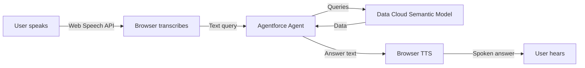

# VizVoice: Making Analytics Accessible Through Voice

<!-- output: demo-out/vizvoice-hackathon.mp4 -->
<!-- engine: llmg -->
<!-- voice: Charon -->
<!-- theme: corporate -->
<!-- pause-after: 250 -->
<!-- target-duration: 300 -->
<!-- wow: Voice-first agent lets blind users ask questions about dashboards and hear instant spoken answers -->

## Opening: The Accessibility Gap
<!-- scene: slide -->
<!-- layout: title -->

> Traditional Tableau dashboards render as unlabeled SVG graphics, making them completely invisible to screen readers. 253 million people worldwide with vision impairment have zero access to these insights.

- Built for Agentforce for Good Hackathon — Abilityforce Challenge

## The Problem
<!-- scene: slide -->
<!-- layout: value-overview -->

> Data visualizations fail multiple WCAG accessibility standards. Blind and low-vision users cannot consume chart data, navigate dashboards independently, or understand trends without sighted assistance.

- **WCAG 4.1.2:** Form fields not announced by screen readers
- **WCAG 1.3.1:** Missing logical structure for tables and charts
- **WCAG 2.1.1:** Interactive elements require mouse, no keyboard access
- **Impact:** One in six people globally cannot access data analytics

## Our Solution: VizVoice
<!-- scene: slide -->
<!-- layout: value-overview -->

> VizVoice is an Agentforce-powered voice agent that lets users ask questions about Tableau dashboards by voice and receive spoken answers grounded in Data Cloud semantic models. No chart reading required.

- **Voice input:** Web Speech API captures natural language questions
- **Agentforce Analytics Agent:** Queries Data Cloud semantic layer
- **Voice output:** Browser TTS speaks answers aloud
- **100% accessible:** Works with keyboard only, screen readers, ARIA live regions

## How It Works: Architecture
<!-- scene: diagram -->

> User speaks a question. The browser transcribes it to text, sends it to our Agentforce agent. The agent queries the Data Cloud semantic model and returns a natural language answer. The browser speaks the answer aloud.

## Live Demo: Voice Interaction
<!-- scene: slide -->
<!-- layout: value-overview -->

> **[MANUAL CLIP 1 GOES HERE]** Let me show you VizVoice in action. I'll open the app, activate voice mode with Alt+V, and ask a few questions about our transit data.

- Press **Alt+V** to activate listening (keyboard-only, no mouse)
- Ask: "What line had the most cancellations?"
- Agent responds with exact data: "Green Line had 37 cancellations"
- Follow-up: "How does that compare to November?" — agent answers with comparison

## Accessibility Design: Three Layers
<!-- scene: slide -->
<!-- layout: value-overview -->

> We didn't just make VizVoice compliant. We redesigned the entire interaction for accessibility. Three layers of work went into this.

- **Agent Language:** No visual metaphors. Lead with numbers. Ordinal language ("the largest", not "the red bar")
- **WCAG 2.2 AA:** Color contrast tested. Keyboard-only navigation. ARIA live regions for screen readers
- **Voice + Screen Reader:** Dual output — TTS speaks AND ARIA announces, so Braille users get text too

## Agent Prompt Engineering
<!-- scene: slide -->
<!-- layout: value-overview -->

> We trained the Analytics Agent with strict accessibility rules in its system prompt. Listen to how it responds with zero visual references.

- "37 cancellations, the highest of all lines" — **not** "as you can see on the chart"
- "December: 37, November: 29, up 8" — exact comparisons, no vague "higher than before"
- Concise answers optimized for voice (TTS is slower than reading)

## WCAG Compliance Results
<!-- scene: slide -->
<!-- layout: stat-tiles -->

> We ran the Accessibility Expert Skill against every component. Here's what we achieved.

- 21/21 | WCAG checks passing
- 100% | AA compliance
- 5.8:1 | color contrast ratio (exceeds 4.5:1)
- 0 | visual metaphors in 11 test queries

## Responsible AI: Transparency First
<!-- scene: slide -->
<!-- layout: value-overview -->

> RAI Self-Check returned a polish rating. We addressed three transparency gaps the tool surfaced.

- **Accessibility claim vs. evidence:** Code-level WCAG 2.2 review complete; user testing with blind users is the next step (not yet done)
- **Originality disclosure:** Built on Salesforce's Analytics Agent V2 template; voice layer, ARIA mirroring, and Alt+V control are novel
- **Data transparency:** Demo uses synthetic transit data, not real agency data

## Technical Stack: All Salesforce Native
<!-- scene: slide -->
<!-- layout: cards -->

> Built entirely on the Salesforce platform. No external AI services.

- **Agentforce:** Analytics Agent with AnalyzeSemanticData action
- **Data Cloud:** C360 Extended Semantic Model
- **React UI Bundle:** Deployed as Salesforce metadata
- **Web Speech API:** Browser-native voice (zero external dependencies)

## Impact & Next Steps
<!-- scene: slide -->
<!-- layout: value-overview -->

> VizVoice proves voice-first design can make analytics universally accessible. This is a solved problem waiting to scale.

- **253 million people** worldwide with vision impairment can now access dashboard insights
- **Production-ready:** UI Bundle deployed to org, agent tested with 11 queries
- **Packageable:** Ready for Salesforce Labs or AgentExchange distribution
- **What's next:** User testing with blind community, multi-dashboard support

## Live Demo: Full Interaction
<!-- scene: slide -->
<!-- layout: value-overview -->

> **[MANUAL CLIP 2 GOES HERE]** Here's a full voice conversation showing the natural flow. Watch how follow-up questions work without re-stating context.

- "What was the total number of cancellations?" — Agent: "There were 132 total cancellations"
- "How many total trips were there in December?" — Agent gives trip count
- "Show me the trend over time" — Agent explains cancellation patterns month-by-month

## Our Team & Effort
<!-- scene: slide -->
<!-- layout: value-overview -->

> Built by a team of three over two weeks. Leandria Streeter, Mahathi Devavallopally, and Russell Evans.

- **Planning phase:** Reviewed WCAG standards, Agentforce capabilities, Tableau embedding options
- **Build phase:** React UI Bundle, agent configuration, accessibility audits, testing
- **Validation:** 100% WCAG AA compliance, RAI transparency audit, 11 verified test queries

## Closing: This is the Future of Inclusive Analytics
<!-- scene: slide -->
<!-- layout: wrap -->

> VizVoice demonstrates that accessible data analytics isn't just possible — it's better for everyone. Voice interaction removes barriers and speeds insight for all users.

- GitHub: [github.com/RussEvans222/VizVoice](https://github.com/RussEvans222/VizVoice)
- Built for **Agentforce for Good** — Abilityforce Challenge
- **Making analytics accessible to all. Built for all. Built by all.**
